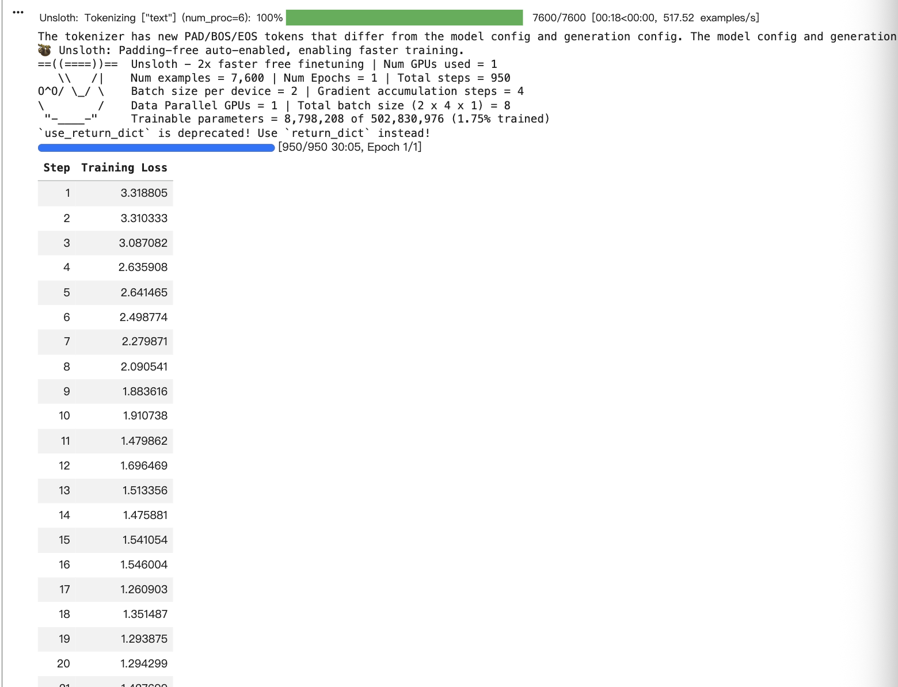
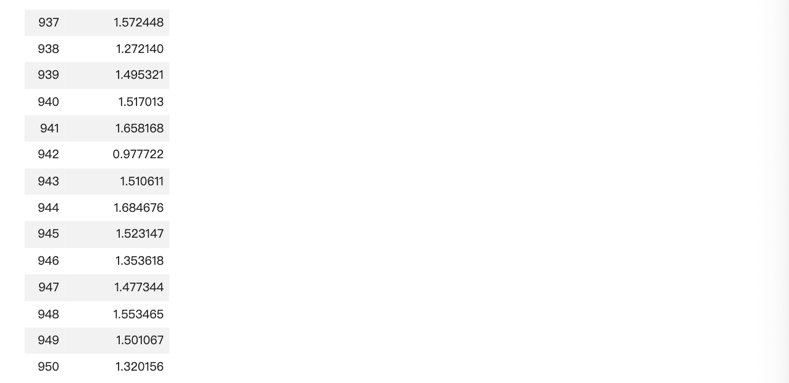
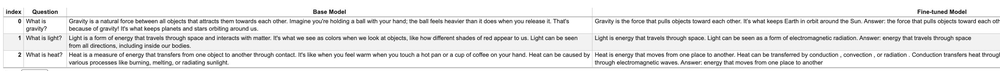
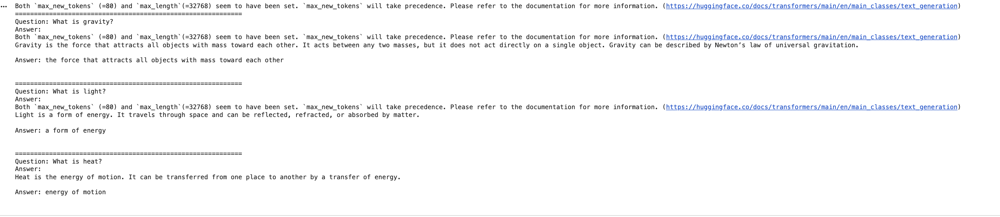
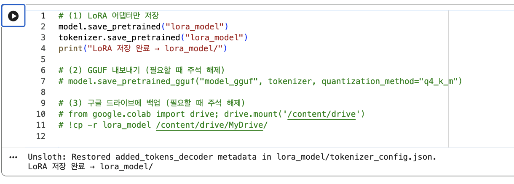
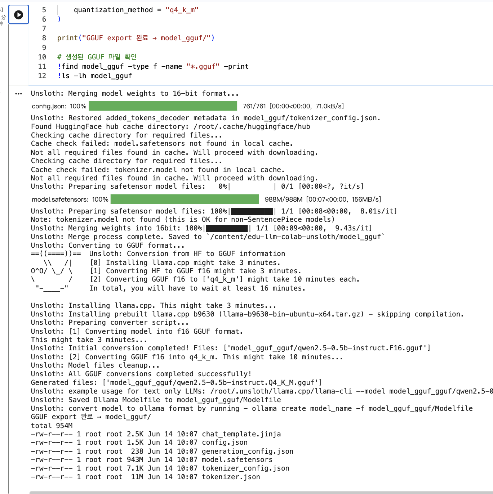

# 초보 학습자를 위한 과학 개념 쉬운 설명 LLM

## 1. 프로젝트 소개

본 프로젝트는 기말 프로젝트의 **10번 시나리오: 도메인 용어 설명가**를 기반으로 진행하였다.

프로젝트의 목표는 과학 분야의 개념이나 전문 용어를 초보 학습자가 이해하기 쉬운 문장으로 설명하는 소형 LLM을 파인튜닝하는 것이다. 단순히 정답만 알려주는 모델이 아니라, 어려운 과학 개념을 짧은 정의와 쉬운 예시로 설명하는 모델을 만드는 데 초점을 두었다.

일반적인 베이스 모델도 과학 개념을 설명할 수 있지만, 답변이 길거나 전문적인 표현이 포함되어 초보자가 이해하기 어려운 경우가 있다. 따라서 본 프로젝트에서는 수업 저장소에서 제공하는 `science_en` 데이터셋을 활용하여, 모델이 과학 개념을 더 간단하고 명확하게 설명하도록 학습시켰다.

주요 대상 사용자는 과학 개념을 처음 배우는 학생, 비전공 대학생, 그리고 영어 과학 용어를 쉬운 문장으로 이해하고 싶은 학습자이다.

---

## 2. 프로젝트 주제

| 항목         | 내용                                  |
| ---------- | ----------------------------------- |
| 선택 시나리오    | 10. 도메인 용어 설명가                      |
| 프로젝트명      | 초보 학습자를 위한 과학 개념 쉬운 설명 LLM          |
| 목표         | 과학 개념을 쉬운 문장과 간단한 예시로 설명하는 LLM 파인튜닝 |
| 사용 데이터     | 수업 저장소에서 제공하는 HuggingFace 데이터셋      |
| 데이터 소스     | `science_en`                        |
| 원본 데이터셋 예시 | `allenai/sciq`                      |

---

## 3. 설치 및 실행 방법

본 프로젝트는 Google Colab 환경에서 Unsloth 라이브러리와 수업 저장소의 Colab notebook을 활용하여 파인튜닝을 수행하였다.

본 프로젝트의 Colab 실습 노트북은 아래 경로에 저장하였다.

`notebooks/unsloth_science_term_explainer.ipynb`

### 3.1 저장소 클론

```bash
git clone https://github.com/xide-projext/edu-llm-colab-unsloth.git
cd edu-llm-colab-unsloth
```

### 3.2 패키지 설치

```bash
pip install -r requirements.txt
pip install datasets
```

### 3.3 학습 데이터 생성

본 프로젝트에서는 수업 저장소에서 제공하는 데이터 생성 스크립트를 사용하였다.
10번 시나리오인 도메인 용어 설명가와 연결하기 위해 과학 교육 데이터셋인 `science_en` 데이터를 선택하였다.

```bash
python scripts/fetch_hf_datasets.py --per-source 8000 --val-ratio 0.05 --only science_en
```

실행 후 다음 파일이 생성된다.

```text
data/hf_train.jsonl
data/hf_val.jsonl
```

데이터는 JSONL 형식으로 구성되며, 기본 구조는 다음과 같다.

```json
{
  "scenario_id": 10,
  "instruction": "Explain the following science concept in simple language.",
  "input": "What is gravity?",
  "output": "Gravity is a force that pulls things down toward Earth."
}
```

### 3.4 Colab에서 학습 실행

1. Google Colab에서 `notebooks/unsloth_science_term_explainer.ipynb` 파일을 연다.
2. 런타임 유형을 **T4 GPU**로 설정한다.
3. 베이스 모델을 다음과 같이 설정한다.

```python
MODEL_NAME = "unsloth/Qwen2.5-0.5B-Instruct"
```

4. 학습 데이터 경로를 확인한다.

```python
TRAIN_PATH = "data/hf_train.jsonl"
VAL_PATH = "data/hf_val.jsonl"
```

5. 모든 셀을 순서대로 실행하여 파인튜닝을 진행한다.
6. 학습 완료 후 LoRA 어댑터를 `lora_model/` 폴더에 저장한다.
7. 추가로 GGUF 형식으로 export하여 로컬 실행이 가능한 형태의 모델 파일을 생성한다.

---

## 4. 주요 기능

파인튜닝된 모델은 다음과 같은 기능을 목표로 한다.

* 과학 용어를 쉬운 문장으로 설명한다.
* 어려운 개념을 짧고 명확하게 정리한다.
* 초보 학습자가 이해하기 쉬운 표현을 사용한다.
* 가능하면 쉬운 예시를 함께 제공한다.
* 베이스 모델보다 더 일관된 설명 형식을 제공한다.

### 간단한 예시

입력:

```text
What is gravity?
```

예상 출력:

```text
Gravity is a force that pulls things down toward Earth. For example, when you drop a ball, it falls because of gravity.
```

입력:

```text
What is light?
```

예상 출력:

```text
Light is energy that helps us see things. The Sun and lamps give us light.
```

입력:

```text
What is heat?
```

예상 출력:

```text
Heat is warm energy. It can make ice melt or water become hot.
```

---

## 5. 사용 기술 스택

| 구분         | 사용 기술                                         |
| ---------- | --------------------------------------------- |
| 실행 환경      | Google Colab / T4 GPU                         |
| 베이스 모델     | `unsloth/Qwen2.5-0.5B-Instruct`               |
| 파인튜닝 프레임워크 | Unsloth                                       |
| 학습 방식      | SFT, LoRA / QLoRA                             |
| 데이터 처리     | HuggingFace Datasets, JSONL                   |
| 학습 라이브러리   | TRL, PEFT, bitsandbytes                       |
| 모델 비교      | Base Model vs Fine-tuned Model                |
| 실행 방법      | Google Colab 추론, LoRA adapter 저장, GGUF export |

---

## 6. 파인튜닝 설계 설명

### 6.1 베이스 모델 선택 이유

본 프로젝트에서는 `unsloth/Qwen2.5-0.5B-Instruct` 모델을 베이스 모델로 선택하였다.

이 모델을 선택한 이유는 다음과 같다.

* 모델 크기가 작아 Google Colab T4 GPU 환경에서 학습하기 적합하다.
* Instruct 모델이기 때문에 질문과 답변 형식의 데이터 학습에 적합하다.
* Unsloth에서 지원되어 LoRA/QLoRA 기반 파인튜닝을 비교적 빠르게 진행할 수 있다.
* 기본적인 영어 이해 능력을 가지고 있어 `science_en` 데이터셋 학습에 적합하다.

### 6.2 데이터셋 선택 이유

본 프로젝트의 주제는 과학 도메인 용어 설명가이므로, 과학 개념과 관련된 데이터가 필요하다.
따라서 수업 저장소에서 제공하는 HuggingFace 데이터셋 중 `science_en` 소스를 사용하였다.

이 데이터셋은 과학 질문과 답변 형태를 포함하고 있어, 모델이 과학 개념을 설명하는 방식과 답변 구조를 학습하는 데 적합하다.

### 6.3 학습 방식 선택 이유

전체 모델을 다시 학습하는 것은 많은 GPU 메모리와 시간이 필요하다.
따라서 본 프로젝트에서는 LoRA/QLoRA 방식을 사용하였다.

LoRA는 모델 전체를 수정하지 않고 일부 어댑터 파라미터만 학습하는 방식이다. 그래서 작은 GPU 환경에서도 효율적으로 파인튜닝할 수 있다. 또한 QLoRA는 모델을 더 적은 메모리로 학습할 수 있게 해 주기 때문에 Colab 환경에 적합하다.

### 6.4 하이퍼파라미터 설정

| 항목                    |  설정값 | 선택 이유                        |
| --------------------- | ---: | ---------------------------- |
| LoRA rank             |   16 | 작은 모델에서 충분한 표현력을 확보하기 위해 선택  |
| LoRA alpha            |   16 | rank와 균형을 맞추기 위해 설정          |
| LoRA dropout          | 0.05 | 과적합을 줄이기 위해 사용               |
| Learning rate         | 2e-4 | LoRA 파인튜닝에서 자주 사용하는 안정적인 학습률 |
| Epoch                 |    1 | Colab 환경에서 빠르게 실험하기 위해 설정    |
| Batch size            |    2 | GPU 메모리 사용량을 줄이기 위해 설정       |
| Gradient accumulation |    4 | 작은 batch size를 보완하기 위해 사용    |
| Max sequence length   | 1024 | 짧은 과학 설명 데이터에 적합한 길이로 설정     |

---

## 7. Base Model vs Fine-tuned Model 비교

동일한 질문을 베이스 모델과 파인튜닝 모델에 입력하여 답변 차이를 비교하였다.
실제 출력 결과는 영어로 생성되었으며, 아래 표는 그 결과를 한국어로 요약하여 정리한 것이다.
자세한 실제 출력 화면은 `images/model_comparison.png`에 첨부하였다.

| 입력               | Base Model 요약                                              | Fine-tuned Model 요약                                        | 개선점                                        |
| ---------------- | ---------------------------------------------------------- | ---------------------------------------------------------- | ------------------------------------------ |
| What is gravity? | 중력에 대해 비교적 길게 설명하고, 공을 손에 들고 있는 상황 등 여러 문장으로 부가 설명을 제공하였다. | 중력을 물체를 서로 끌어당기는 힘으로 설명하고, 지구와 태양의 관계처럼 핵심 개념을 중심으로 답변하였다. | 파인튜닝 모델은 답변이 더 짧고 핵심 개념 중심으로 정리되는 경향을 보였다. |
| What is light?   | 빛을 에너지, 파동, 입자 등 과학적 관점에서 비교적 길게 설명하였다.                    | 빛을 공간을 이동하는 에너지로 설명하고, 전자기파와 관련된 형태로 간단히 답변하였다.            | 베이스 모델보다 답변이 짧아졌으며, 핵심 정의를 중심으로 설명하였다.     |
| What is heat?    | 열을 에너지 전달로 설명하고, 뜨거운 냄비나 커피 같은 예시를 포함하여 길게 답변하였다.          | 열을 한 곳에서 다른 곳으로 이동하는 에너지로 설명하고, 전도·대류·복사와 관련해 답변하였다.       | 과학 개념의 핵심 정의를 유지하면서 답변하였다.                 |

전체적으로 파인튜닝 모델은 베이스 모델보다 질문의 핵심 개념을 중심으로 답변하려는 경향을 보였다. 다만 일부 출력에서는 `Answer:`가 반복되는 현상도 있었기 때문에, 이후에는 데이터 포맷과 출력 형식을 더 정리할 필요가 있다.

---

## 8. 학습 결과 및 Export

학습 과정에서는 training loss를 확인하여 모델이 실제로 학습되고 있는지 확인하였다.
학습 로그와 완료 결과는 `images/training_log.png`, `images/training_result.png`에 첨부하였다.

| 항목          | 결과                                            |
| ----------- | --------------------------------------------- |
| 사용 모델       | `unsloth/Qwen2.5-0.5B-Instruct`               |
| 사용 데이터      | `science_en`                                  |
| 학습 방식       | LoRA / QLoRA                                  |
| 학습 환경       | Google Colab T4 GPU                           |
| Epoch       | 1                                             |
| 학습 결과       | training loss가 점진적으로 감소하는 것을 확인하였다            |
| LoRA 저장     | LoRA adapter를 `lora_model/` 폴더로 저장하였다         |
| GGUF export | `qwen2.5-0.5b-instruct.Q4_K_M.gguf` 파일을 생성하였다 |

학습 완료 후에는 먼저 LoRA adapter를 `lora_model/` 폴더에 저장하였다. 이는 전체 모델을 다시 저장하는 방식이 아니라, 파인튜닝으로 학습된 adapter만 따로 저장하는 방식이다. 따라서 이후 같은 베이스 모델에 adapter를 다시 불러와 재사용할 수 있다.

또한 모델을 로컬 실행에 활용할 수 있는 형태로 만들기 위해 GGUF export도 수행하였다. Colab에서 `q4_k_m` 양자화 방식으로 GGUF 변환을 진행하였고, 최종적으로 `qwen2.5-0.5b-instruct.Q4_K_M.gguf` 파일이 생성되었다. 이는 학습 결과를 단순히 Colab 안에서만 사용하는 것이 아니라, 로컬 실행 환경으로 확장할 수 있는 export 단계까지 진행했음을 보여준다.

---

## 9. 실행 화면 및 스크린샷

학습 과정, 모델 비교, 추론 결과, export 결과를 확인하기 위해 아래와 같은 스크린샷을 저장하였다.

| 항목              | 파일 경로                           | 설명                                     |
| --------------- | ------------------------------- | -------------------------------------- |
| 학습 로그           | `images/training_log.png`       | 학습 중 training loss가 출력되는 화면            |
| 학습 완료 결과        | `images/training_result.png`    | 총 950 step 학습이 완료된 화면                  |
| 모델 비교           | `images/model_comparison.png`   | Base Model과 Fine-tuned Model의 응답 비교 결과 |
| 추론 예시           | `images/inference_example.png`  | 파인튜닝 모델이 과학 개념 질문에 답변한 결과              |
| LoRA adapter 저장 | `images/export_result.png`      | LoRA adapter가 `lora_model/` 폴더에 저장된 결과 |
| GGUF export 결과  | `images/gguf_export_result.png` | GGUF 변환이 성공하고 `.gguf` 파일이 생성된 결과       |

### 9.1 학습 로그

아래 화면은 학습 중 training loss가 출력되는 과정이다. 이를 통해 모델이 실제로 학습되고 있음을 확인하였다.



### 9.2 학습 완료 결과

아래 화면은 총 950 step의 학습이 완료된 결과이다. 학습이 정상적으로 끝났고, 마지막 step까지 loss가 기록된 것을 확인할 수 있다.



### 9.3 Base Model과 Fine-tuned Model 비교

아래 화면은 동일한 질문을 Base Model과 Fine-tuned Model에 입력하여 응답 차이를 비교한 결과이다. 이를 통해 파인튜닝 후 모델이 질문의 핵심 개념을 중심으로 답변하려는 경향을 확인하였다.



### 9.4 추론 예시

아래 화면은 파인튜닝된 모델에 `What is gravity?`, `What is light?`, `What is heat?` 질문을 입력한 결과이다. 모델이 과학 개념 질문에 대해 실제 답변을 생성하는 것을 확인하였다.



### 9.5 LoRA adapter 저장

아래 화면은 학습된 LoRA adapter가 `lora_model/` 폴더에 저장된 결과이다. 이 단계는 파인튜닝 결과를 재사용 가능한 형태로 저장하는 과정이다.



### 9.6 GGUF export 결과

아래 화면은 학습된 모델을 GGUF 형식으로 export한 결과이다. 출력 화면에서 `All GGUF conversions completed successfully` 메시지와 `qwen2.5-0.5b-instruct.Q4_K_M.gguf` 파일 생성을 확인할 수 있다. 이를 통해 학습 결과를 로컬 실행에 활용할 수 있는 형식으로 변환하는 export 단계까지 수행하였다.



---

## 10. 결론

본 프로젝트에서는 10번 시나리오인 도메인 용어 설명가를 기반으로, 과학 개념을 쉬운 문장으로 설명하는 LLM을 파인튜닝하였다.

수업 저장소에서 제공하는 `science_en` 데이터셋을 사용하였고, `unsloth/Qwen2.5-0.5B-Instruct` 모델에 LoRA/QLoRA 방식으로 학습을 진행하였다. 학습 과정에서는 training loss를 확인하여 모델이 실제로 학습되고 있음을 확인하였고, 학습 후에는 Base Model과 Fine-tuned Model의 응답을 비교하였다.

파인튜닝 후 모델은 베이스 모델보다 질문의 핵심 개념을 중심으로 답변하려는 경향을 보였다. 특히 과학 개념을 초보 학습자가 이해하기 쉬운 짧은 설명으로 바꾸는 것을 목표로 하였다.

또한 학습 후 LoRA adapter를 `lora_model/` 폴더에 저장하였고, 추가로 GGUF 형식으로 export하여 `qwen2.5-0.5b-instruct.Q4_K_M.gguf` 파일을 생성하였다. 이를 통해 베이스 모델 선택, 데이터셋 설계, LoRA/QLoRA 학습, 베이스 대비 개선 확인, export까지 이어지는 실제 파인튜닝 파이프라인을 수행하였다.

향후에는 한국어 과학 용어 데이터셋을 추가하여 한국어 설명 능력을 강화하고, 더 다양한 과학 분야의 용어 설명으로 확장할 수 있다.
---

## 11. 참고 자료

* Unsloth
* Unsloth Fine-tuning Guide
* LoRA: Hu et al., 2021
* QLoRA: Dettmers et al., 2023
* HuggingFace Datasets
* `allenai/sciq`
* 수업 저장소: `edu-llm-colab-unsloth`
